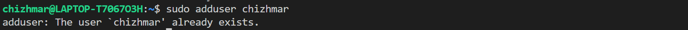
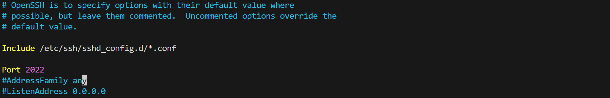
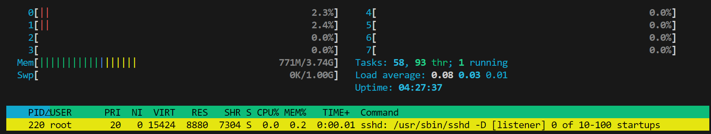
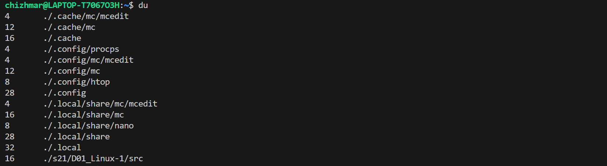
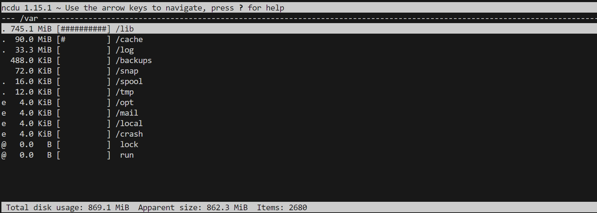

## Part 1. Установка ОС
- cat /etc/issue

## Part 2. Создание пользователя
- sudo adduser

- cat /etc/passwd

## Part 3. Настройка сети ОС
- Задать название машины вида user-1: sudo hostnamectl set-hostname user-1

- Установить временную зону, соответствующую вашему текущему местоположению: timedatectl set-timezone Europe/Moscow

- date

- Вывести названия сетевых интерфейсов с помощью консольной команды: ifconfig \
Lo - виртуальный интерфейс по умолчанию для отладки сетевых программ и запуска серверных приложений на локальном компьютере \
ip-адрес стоит после слова "inet"

- DHCP - Dynamic Host Configuration Protocol

- Определить и вывести на экран внешний ip-адрес шлюза (ip) и внутренний IP-адрес шлюза\
  Мой внешний ip: curl ifconfig.co\
  Мой внутренний ip: nslookup localhost

- Задать статичные настройки ip, gw, dns:\
  cd /etc/netplan/\
  sudo vi 01-netcfg.yaml\
  sudo netplan apply

- Перезагрузить систему: reboot

## Part 4. Обновление ОС
- Обновить системные пакеты до последней на момент выполнения задания версии:
- sudo apt-get upgrade

## Part 5. Использование команды sudo
- Разрешить пользователю, созданному в Part 2, выполнять команду sudo: 
    1. переключаемся на root: sudo -i (также можно использовать "su - username")
    2. разрешаем sudo: usermod -a -G sudo chizhmar

- Команда sudo позволяет выполнить команду от имени другого пользователя.\
Как правило, используется от root для повышения прав доступа для обычного пользователя.

## Part 6. Установка и настройка службы времени

- Настроить службу автоматической синхронизации времени: timedatectl show

## Part 7. Установка и использование текстовых редакторов

- Установить текстовые редакторы VIM (+ любые два по желанию NANO, MCEDIT, JOE и т.д.): sudo apt-get install mcedit

### Vim

- создание файла: vim test_vim.txt
- Для выхода нажал Esc, а потом ввёл команду :wq

- Для выхода без сохранения изменений нажал Esc, а потом ввёл команду :q!

- Для поиска использовал команду /School

- Для замены использовал команду :s/School/newtonbe

### Nano

- создание файла: nano test_nano.txt
- Для выхода нажал Ctrl + X, а потом Y

- Для выхода без сохранения изменений нажал Ctrl + X, а потом N

- Для поиска использовал команду Ctrl + W

- Для замены использовал команду Ctrl + \

### Mcedit

- создание файла: mcedit test_mcedit.txt
- Для выхода нажал Esc, а потом Y

- Для выхода без сохранения изменений нажал Esc, а потом N

- Для поиска использовал команду Alt + 7 (можно Fn + F7)

- Для замены использовал команду Alt + 4

## Part 8. Установка и базовая настройка сервиса SSHD

- Установить службу SSHd: sudo apt install openssh-server

- Добавить автостарт службы при загрузке системы: sudo systemctl enable ssh

- Перенастроить службу SSHd на порт 2022:
  1. sudo vim /etc/ssh/sshd_config
  2. В этом файле находим Port и пишем 2022

- Используя команду ps, показать наличие процесса sshd:\
ps -e | grep sshd\
команда **ps** показывает сведения о текущих процессах; **-e** - все процессы, **grep** - поиск

- netstat -tan

- **-t** - перечисление всех TCP портов
- **-a** - перечисление всех портов
- **-n** - поиск без резолва IP/имён

- **Proto** - протокол, использующийся сокетом
- **Recv-Q** - количество байтов, не скопированных пользовательской программой, подключенной к этому сокету
- **Send-Q** - количество байтов, не подтвержденных удаленным хостом
- **Local Address** - локальный адрес, участвующий в соединении
- **Foreign Address** - внешний адрес, участвующий в соединении
- **0.0.0.0** - это означает, что в соединении могут использоваться любые IP-адреса

## Part 9. Установка и использование утилит top, htop

### top:
- **uptime** - 3 минуты 58 секунд
- **количество авторизованных пользователей** - 3
- **общую загрузка системы** - 0.13
- **общее количество процессов** - 57
- **загрузка cpu** - 0.7%
- **загрузка памяти** - 737.6М
- **pid процесс, занимающий больше всего памяти** - 513
- **pid процесс, занимающий больше всего процессорного времени** - 401

### htop:

- Сортировка по PID:

- Сортировка по PERCENT_CPU:

- Сортировка по PERCENT_MEM:

- Сортировка по TIME:

- Фильтр для процесса sshd:

- Процесс syslog

- Вывод hostname, clock и uptime

## Part 10. Использование утилиты fdisk

- Название диска: /dev/sdb
- Размер: 1 GiB
- Количество секторов: 2097160
- Размер swap: 1 GiB

## Part 11. Использование утилиты df
- размер раздела: 263112772
- размер занятого пространства: 1727632
- размер свободного пространства: 247946984
- процент использования: 1%
- единица измерения: Кб
---
- размер раздела: 251G
- размер занятого пространства: 1.7G
- размер свободного пространства: 237G
- процент использования: 1%
- тип файловой системы для раздела: ext4

## Part 12. Использование утилиты du

- команда du:

- размер папок /home, /var, /var/log

- размер содержимого папки /var/log

## Part 13. Установка и использование утилиты ncdu

- установка: sudo apt install ncdu

- размер папки /home:

- размер папки /var:

- размер папки /var/log:

## Part 14. Работа с системными журналами
- время последней успешной авторизации: 18:17:02
- имя пользователя: root
- метод входа в систему: pam_unix(cron:session)
- перезапуск службы sshd: sudo systemctl restart ssh

## Part 15. Использование планировщика заданий CRON
- Скрипт в CRON:

- Проверка работы:

- Логи:

- Удаление: crontab -r

