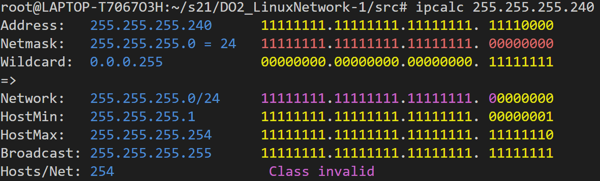
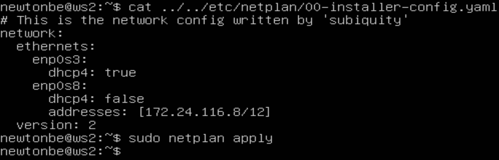
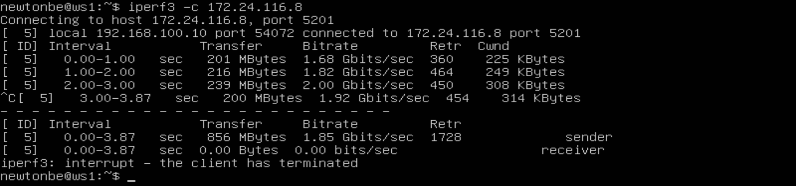
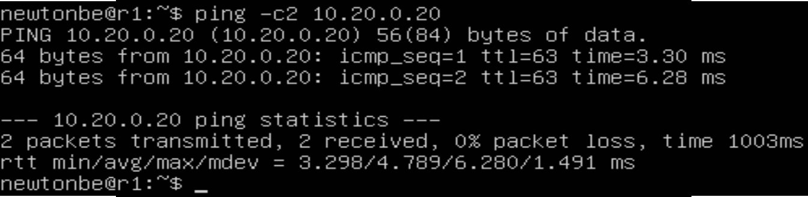
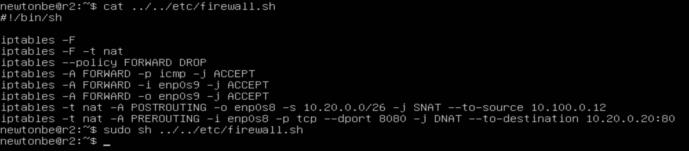

## Part 1. Инструмент ipcalc

### 1.1 Сети и маски
##### 1) адрес сети 192.167.38.54/13 - это 192.160.0.0

##### 2) перевод маски 
- 255.255.255.0

префиксная запись - 24, двоичная - 11111111.11111111.11111111.00000000

- /15

обычная запись - 255.254.0.0, двоичная - 11111111.11111110.00000000.00000000

- 11111111.11111111.11111111.11110000

обычная запись - 255.255.255.240, префиксная - /28

##### 3) минимальный и максимальный хост в сети 12.167.38.4 при масках:

- /8

Минимальный хост - 12.0.0.1, максимальный - 12.255.255.254

- 11111111.11111111.00000000.00000000

Минимальный хост - 12.167.0.1, максимальный - 12.167.255.254

- 255.255.254.0

Минимальный хост - 12.167.38.1, максимальный - 12.167.39.254

- /4

Минимальный хост - 0.0.0.1, максимальный - 15.255.255.254

### 1.2 localhost

- Под localhost зарезервированы частные адреса с 127.0.0.0 по 127.255.255.255, соответственно, если адрес попадает в этот промежуток, то с него можно обратиться к приложению, работающему на localhost.  
Таким образом, с IP **127.0.0.2** и **127.1.0.1** можно обратиться, а с IP **194.34.23.100** и **128.0.0.1** - нет

### 1.3. Диапазоны и сегменты сетей

##### 1) какие из перечисленных IP можно использовать в качестве публичного, а какие только в качестве частных: 10.0.0.45, 134.43.0.2, 192.168.4.2, 172.20.250.4, 172.0.2.1, 192.172.0.1, 172.68.0.2, 172.16.255.255, 10.10.10.10, 192.169.168.1

- частные: 10.0.0.45, 192.168.4.2, 172.20.250.4, 172.16.255.255, 10.10.10.10  

- публичные: 134.43.0.2, 172.0.2.1, 192.172.0.1, 172.68.0.2, 192.169.168.1  

##### 2) какие из перечисленных IP адресов шлюза возможны у сети 10.10.0.0/18: 10.0.0.1, 10.10.0.2, 10.10.10.10, 10.10.100.1, 10.10.1.255

- IP адрес шлюза должен находиться в диапазоне от минимального до максимального хоста.  
Таким образом, возможны следующие IP адреса шлюза: **10.10.0.2, 10.10.10.10, 10.10.1.255**

Минимальный хост - 10.10.0.1, максимальный - 10.10.63.254

## Part 2. Статическая маршрутизация между двумя машинами

- ws1

- ws2

- ws1: 192.168.100.10/16

- ws2: 172.24.116.8/12

### 2.1. Добавление статического маршрута вручную

- статическая маршрутизация с помощью sudo ip r add и ping

### 2.2. Добавление статического маршрута с сохранением

- перезапускаем машины с помощью sudo reboot

- добавляем статические маршруты с помощью etc/netplan/00-installer-config.yaml, потом применяем настройки с помощью netplan apply и пингуем

## Part 3. Утилита iperf3

### 3.1. Скорость соединения

- 8 Mbps = 1 MB/s, 100 MB/s = 800000 Kbps, 1 Gbps = 1000 Mbps

### 3.2. Утилита iperf3

- Измерить скорость соединения между ws1 и ws2

## Part 4. Сетевой экран
### 4.1. Утилита iptables

1) на ws1 применить стратегию когда в начале пишется запрещающее правило, а в конце пишется разрешающее правило (это касается пунктов 4 и 5)

2) на ws2 применить стратегию когда в начале пишется разрешающее правило, а в конце пишется запрещающее правило (это касается пунктов 4 и 5)

3) открыть на машинах доступ для порта 22 (ssh) и порта 80 (http)

4) запретить echo reply (машина не должна "пинговаться”, т.е. должна быть блокировка на OUTPUT)

5) разрешить echo reply (машина должна "пинговаться")

- содержимое файлов /etc/firewall.sh и их запуск:

- так как правила в iptables читаются сверху вниз, то, если первым будет описано запрещающее правило, то все разрешающие правила, находящиеся снизу, не сработают. А в обратном случае получится пинговаться.

### 4.2. Утилита nmap

- как и ожидалось, пингануть 192.168.100.10 не получилось

## Part 5. Статическая маршрутизация сети
### 5.1. Настройка адресов машин

- Перезапустить сервис сети. Если ошибок нет, то командой ip -4 a проверить, что адрес машины задан верно. Также пропинговать ws22 с ws21. Аналогично пропинговать r1 с ws11.

### 5.2. Включение переадресации IP-адресов.

- sysctl -w net.ipv4.ip_forward=1

- net.ipv4.ip_forward=1

### 5.3. Установка маршрута по умолчанию

- Настроить маршрут по-умолчанию (шлюз) для рабочих станций. Для этого добавить default перед IP роутера в файле конфигураций

- ip r

- ping и tcpdump

### 5.4. Добавление статических маршрутов

- Добавить в роутеры r1 и r2 статические маршруты в файле конфигураций

- ip r

- ip r list

- у IP 0.0.0.0 маска меньше, так как роутер выбирает путь с наибольшей маской. В связи с этим default адрес никогда не был бы достигнут.

### 5.5. Построение списка маршрутизаторов

- tcpdump -tnv -i eth0

- для корректной работы пришлось чуть изменить файлы конфигураций роутеров (можно было сделать по-другому и не писать gateway4, а просто в routes дописать маску, например в yaml файле машины r1 вместо "- to: 10.20.0.0" написать "- to: 10.20.0.0/26")

- traceroute 

- traceroute отправляет 3 пакета, каждый раз увеличивая значение поля TTL пакета, пока он не достигнет цели

### 5.6. Использование протокола ICMP при маршрутизации

- tcpdump -n -i eth0 icmp 

- ping -c 1 10.30.0.111

## Part 6. Динамическая настройка IP с помощью DHCP

- /etc/dhcp/dhcpd.conf и /etc/resolv.conf машины r2

- systemctl restart isc-dhcp-server

- reboot, ip a, пинг

- yaml файл ws11. Дополнительно в Virtual Box в настройках машины явно указываем MAC-адрес

- /etc/dhcp/dhcpd.conf и /etc/resolv.conf машины r1

- systemctl restart isc-dhcp-server

- проверяем адрес и соединение:

- до обновление ip адреса ws21:

- после:

- sudo dhclient -r удаляет текущий IP, sudo dhclient запрашивает у сервера новый IP и устанавливает его

## Part 7. NAT

- В файле /etc/apache2/ports.conf на ws22 и r1 изменить строку Listen 80 на Listen 0.0.0.0:80, то есть сделать сервер Apache2 общедоступным

- service apache2 start

- Добавить в фаервол, созданный по аналогии с фаерволом из Части 4, на r2 следующие правила:

1) удаление правил в таблице filter - iptables -F

2) удаление правил в таблице "NAT" - iptables -F -t nat

3) отбрасывать все маршрутизируемые пакеты - iptables --policy FORWARD DROP

- Как и ожидалось, ws22 не пингуется

4) разрешить маршрутизацию всех пакетов протокола ICMP

- Как и ожидалось, ws22 пингуется

5) включить SNAT, а именно маскирование всех локальных ip из локальной сети, находящейся за r2 (по обозначениям из Части 5 - сеть 10.20.0.0)

6) включить DNAT на 8080 порт машины r2 и добавить к веб-серверу Apache, запущенному на ws22, доступ извне сети

- Проверить соединение по TCP для SNAT, для этого с ws22 подключиться к серверу Apache на r1 командой telnet

- Проверить соединение по TCP для DNAT, для этого с r1 подключиться к серверу Apache на ws22 командой telnet (обращаться по адресу r2 и порту 8080)

## Part 8. Дополнительно. Знакомство с SSH Tunnels

- Запустить на r2 фаервол с правилами из Части 7

- Запустить веб-сервер Apache на ws22 только на localhost (то есть в файле /etc/apache2/ports.conf изменить строку Listen 80 на Listen localhost:80)

- Воспользоваться Local TCP forwarding с ws21 до ws22, чтобы получить доступ к веб-серверу на ws22 с ws21. (ssh -L 9999:localhost:80 10.20.0.20)
Предварительно на ws22 нужно включить службу ssh: systemctl start ssh.

- Воспользоваться Remote TCP forwarding c ws11 до ws22, чтобы получить доступ к веб-серверу на ws22 с ws11(ssh -R 9999:localhost:80 10.20.0.20)

- Проверка соединения:

